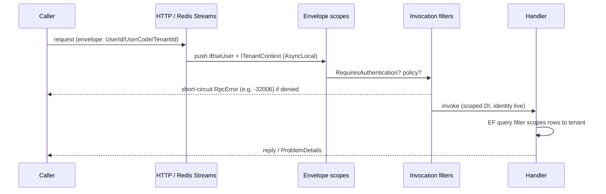

# RFC-0001: Framework Overview

- **Status:** Implemented
- **Date:** 2026-07-05
- **Authors:** BSE Framework Team
- **Related ADRs:** ADR-0001, ADR-0009
- **Related RFCs:** RFC-0002, RFC-0003, RFC-0004, RFC-0005, RFC-0006, RFC-0007, RFC-0008

## Abstract

`Bse.Framework` is a modular .NET 9 framework for building distributed, multi-tenant web APIs and microservices. It replaces the patterns duplicated across the legacy Stud2, SafePack2, and Orange2 applications with 21 focused NuGet packages composed through a single dependency-injection entry point. This RFC describes the framework as a whole: its layering, package graph, composition model, the ambient-context pattern that carries identity, tenant, and calendar across process boundaries, and the cross-cutting conventions (error taxonomy, observability, security) that every subsystem shares. The subsystems themselves are specified in RFC-0002 through RFC-0008.

## Motivation

The three legacy line-of-business systems each re-implemented the same concerns — authentication, multi-tenancy, data access, logging, inter-service calls — on .NET Framework 4.6.1 with Unity, EF6 DB-first, DES tokens, and bespoke pagination. The duplication was expensive to maintain and inconsistent in behavior (three different pagination strategies, three different logging destinations, three different tenancy conventions).

`Bse.Framework` consolidates these concerns into one toolkit built on modern .NET:

| Concern | Legacy (Stud2 / SafePack2 / Orange2) | Bse.Framework |
|---|---|---|
| Runtime | .NET Framework 4.6.1 | .NET 9 |
| DI | Unity 5.9.3 | Microsoft.Extensions.DependencyInjection |
| ORM | EF6 DB-first | EF Core (writes) + Dapper (reads) |
| Auth | DES tokens | JWT bearer + opaque, via `BSE.Common` adapter |
| Inter-service | direct DB / ad-hoc HTTP | JSON-RPC 2.0 over Redis Streams or HTTP |
| Logging | DB / Prometheus / none | OpenTelemetry → Grafana (Tempo/Loki/Prometheus) |
| Tenancy | implicit CompCode columns | ambient `ITenantContext` + EF query-filter isolation |

## Goals

- Provide one composable framework where a service takes only the packages it needs.
- Keep abstractions and implementations in separate packages (the `Microsoft.Extensions.*` pattern) so implementations can be swapped or faked.
- Carry identity, tenant, and calendar context transparently across HTTP and RPC boundaries.
- Make cross-cutting behavior (errors, telemetry, security) consistent and correct by default.
- Prefer compile-time generation over runtime reflection.

## Non-Goals

- A UI or front-end framework.
- A general-purpose service bus or workflow engine (the RPC layer is request/response + notifications, not saga orchestration).
- Physical database-per-tenant isolation (see RFC-0006 for the shared-database + query-filter model).
- An in-framework OAuth authorization server (auth reuses `BSE.Common.Security` — see ADR-0004).

## Design

### Overview

The framework is layered. `Bse.Framework.Core` sits at the bottom with zero framework dependencies; every other package depends on Core and, where relevant, on a small number of sibling abstractions. Implementation packages (EF Core, Dapper, Redis Streams, HTTP, Hijri, JWT) depend on their abstraction package but never on each other.

```
                         ┌─────────────────────────┐
                         │   Bse.Framework.Core     │  DI, exceptions, Result<T>,
                         │   (no framework deps)     │  clock, GUIDs, redaction,
                         └────────────┬─────────────┘  ProblemDetails, shutdown, health
        ┌───────────────┬────────────┼───────────────┬────────────────┐
        │               │            │               │                │
   ┌────┴────┐    ┌─────┴────┐  ┌────┴────┐    ┌──────┴─────┐   ┌──────┴─────┐
   │  Rpc    │    │  Data    │  │  Auth   │    │MultiTenancy│   │Localization│
   │ + gen   │    │ +EF/Dpr  │  │+Jwt/Rpc │    │+AspNet/Rpc │   │  + Hijri   │
   └────┬────┘    └──────────┘  └─────────┘    └────────────┘   └────────────┘
        │
   ┌────┴──────────────┐        ┌───────────────┐   ┌─────────────┐   ┌───────────┐
   │ Rpc.RedisStreams  │        │  Telemetry     │  │ Validation  │   │    Web    │
   │ Rpc.Http          │        │ (OTel→Grafana) │  │ (BSE.Common)│   │(BSE.Common)│
   └───────────────────┘        └───────────────┘   └─────────────┘   └───────────┘
        │
   ┌────┴──────────────┐
   │ Testing (in-mem    │
   │ transport + rig)   │
   └───────────────────┘
```

### Components

The 21 packages group into eight subsystems, each with its own RFC:

- **Core & Testing** — `Bse.Framework.Core` (composition, exceptions, `Result<T>`, `ISystemClock`, `IGuidGenerator`, redaction, RFC 9457 ProblemDetails, graceful shutdown, health checks) and `Bse.Framework.Testing` (in-memory RPC transport + two-service `BseRpcTwoServiceRig`).
- **RPC & Source Generation** (RFC-0002) — `Bse.Framework.Rpc`, `Bse.Framework.Rpc.RedisStreams`, `Bse.Framework.Rpc.Http`, `Bse.Framework.SourceGenerators`, `Bse.Framework.SourceGenerators.Attributes`.
- **Data Access** (RFC-0003) — `Bse.Framework.Data`, `Bse.Framework.Data.EntityFramework`, `Bse.Framework.Data.Dapper`.
- **Auth, Identity & Authorization** (RFC-0004) — `Bse.Framework.Auth`, `Bse.Framework.Auth.Jwt`, `Bse.Framework.Auth.Rpc`.
- **Telemetry** (RFC-0005) — `Bse.Framework.Telemetry`.
- **Multi-Tenancy** (RFC-0006) — `Bse.Framework.MultiTenancy`, `Bse.Framework.MultiTenancy.AspNetCore`, `Bse.Framework.MultiTenancy.Rpc`.
- **Localization** (RFC-0007) — `Bse.Framework.Localization`, `Bse.Framework.Localization.Hijri`.
- **Web Hardening & Validation** (RFC-0008) — `Bse.Framework.Web`, `Bse.Framework.Validation`.

### Composition Model

A service composes the framework through one entry point, `AddBseFramework`, which yields an `IBseFrameworkBuilder`:

```csharp
public interface IBseFrameworkBuilder
{
    IServiceCollection Services { get; }
    void RegisterModule<TModule>() where TModule : IBseModule;
    bool HasModule<TModule>() where TModule : IBseModule;
}
```

Each feature package extends `IBseFrameworkBuilder` with an `AddBseXxx(...)` method that:

1. calls `RegisterModule<BseXxxModule>()` — a no-op `IBseModule` marker recorded in a `HashSet<Type>`;
2. asserts prerequisites via `HasModule<T>()` (e.g. the Auth.Rpc integration requires the RPC module);
3. registers its services with `TryAdd` semantics so an application (or a test) may pre-register an override.

```csharp
services.AddBseFramework(framework =>
{
    framework.AddBseRpc(rpc =>
    {
        rpc.ServiceName = "students";
        rpc.UseEnvironmentKeys().UseEncryptedBrotliCodec().AddBseRpcGeneratedHandlers();
        rpc.UseRedisStreams(connectionString).UseRedisStreamsServer();
    });
    framework.AddBseAuth();
    framework.AddBseMultiTenancy(t => t.AddResolver<HeaderTenantResolver>());
    framework.AddBseTelemetry(t => t.UseOtlpExporter(otlpEndpoint));
});

app.UseBseExceptionHandler();   // RFC 9457 ProblemDetails — must be first
```

This module + `TryAdd` design (ADR-0001) is what makes the framework additive: packages compose in any order, double-registration is a no-op, and every default is overridable.

### The Ambient-Context Pattern

Identity, tenant, and calendar all follow the same pattern — an `AsyncLocal`-backed accessor whose value is stamped onto the RPC envelope at the outbound boundary and re-pushed on the inbound side:

| Concern | Accessor | Envelope field | Outgoing decorator | Inbound scope |
|---|---|---|---|---|
| User | `IBseUserAccessor` | `UserId`, `UserCode` | `BseUserOutgoingEnvelopeDecorator` | `BseUserRpcEnvelopeScope` |
| Tenant | `ITenantContextAccessor` | `TenantId` | `TenantOutgoingEnvelopeDecorator` | `TenantRpcEnvelopeScope` |
| Calendar | `ICalendarContextAccessor` | — (process-local) | — | — |

Only minimal, non-authoritative identity crosses the wire (`UserId` + `UserCode` + `TenantId`); richer identity (roles, claims, company/branch/fiscal-year) is re-fetched downstream and never trusted from the envelope (ADR-0013). This keeps the wire small and prevents stale-claim propagation.

### Data Flow

An inbound request — whether it arrives over HTTP or over the RPC transport — is normalized into the same execution context before business logic runs:



### Error Handling

The framework defines a flat exception taxonomy in Core; each maps deterministically to an HTTP status and a JSON-RPC error code:

| Exception | HTTP | JSON-RPC |
|---|---|---|
| `BseValidationException` | 400 | −32602 InvalidParams |
| `BseAuthenticationException` | 401 | −32006 Unauthenticated |
| `BseAuthorizationException` | 403 | −32007 Forbidden |
| `BseNotFoundException` | 404 | −32004 NotFound |
| `BseConcurrencyException` | 409 | −32005 ConcurrencyConflict |
| `BseConfigurationException` / `BseDataAccessException` | 500 | −32603 InternalError |

`UseBseExceptionHandler()` converts any exception into an RFC 9457 `ProblemDetails` response (stack traces omitted, `traceId` attached); the RPC dispatcher performs the equivalent mapping to a typed `RpcError` reply (RFC-0002).

### Configuration

Options are POCOs populated through the fluent builder callbacks (`AddBseRpc(rpc => …)`, `AddBseTelemetry(t => …)`), not bound from `IConfiguration` sections by the framework itself. This keeps configuration explicit and testable; applications may still source values from `IConfiguration` inside the callback.

### Security Considerations

Defense in depth is layered across the subsystems: encrypted + integrity-protected RPC payloads (ADR-0011/0012), minimal cross-process identity with downstream re-fetch (ADR-0013), per-handler authentication gating (ADR-0014), EF query-filter tenant isolation with a cross-tenant write guard (RFC-0006), PII redaction in telemetry (RFC-0005), and security-header + rate-limit hardening (RFC-0008).

### Observability

Every subsystem emits OpenTelemetry signals under the `Bse.*` namespace; `Bse.Framework.Telemetry` wires traces, metrics, and logs to an OTLP endpoint (Grafana stack) with W3C trace-context propagation carried on the RPC envelope. `BseLogScopes` defines canonical structured-logging keys (trace, span, correlation, tenant, user, service, method) shared across packages.

### Testing Strategy

`Bse.Framework.Testing` provides an in-memory transport and a two-service rig (`BseRpcTwoServiceRig`) that exercises the real dispatcher, codec, and exception mapping end-to-end without Docker. Cross-process identity and tenancy propagation are verified through this rig; the Redis Streams and HTTP transports and the EF data layer are covered by Testcontainers-backed integration tests. Unit tests use xUnit + Shouldly + NSubstitute.

## Migration Path

The framework is adopted incrementally, one package at a time, alongside the legacy code:

1. Introduce `AddBseFramework()` and `Bse.Framework.Core` (errors, ProblemDetails, clock).
2. Add `Bse.Framework.Telemetry` for observability with no behavior change.
3. Move read/write data access onto `Bse.Framework.Data` (EF + Dapper) per aggregate.
4. Replace ad-hoc inter-service calls with `Bse.Framework.Rpc` handlers.
5. Layer in `Auth`, `MultiTenancy`, `Web`, and `Validation` as the service is modernized.

Each step is independently shippable because the packages are additive and default-overridable.

## Open Questions

- **Policy-based authorization** (`Bse.Framework.Policy`, `[RequiresPolicy]`) is designed but not yet implemented; it will plug into the RPC invocation-filter pipeline introduced in ADR-0014 without further dispatcher changes.
- **Keyset/cursor pagination** is not yet implemented; the data layer currently offers offset pagination only (RFC-0003).
- **Message/string localization** (resx-style) is out of scope; `Bse.Framework.Localization` covers calendars only (RFC-0007).

## References

- ADR-0001: Modular NuGet Package Architecture
- ADR-0009: Segregated Transport Interfaces
- RFC-0002 … RFC-0008 (subsystem designs)
- `Microsoft.Extensions.*` composition pattern; ABP Framework; Dapr building-block model
