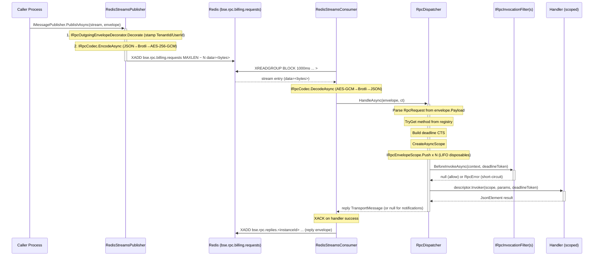

# RFC-0002: RPC, Source Generation, and the Invocation Pipeline

- **Status:** Implemented
- **Date:** 2026-07-05
- **Authors:** BSE Framework Team
- **Related ADRs:** ADR-0002, ADR-0008, ADR-0009, ADR-0011, ADR-0012, ADR-0013, ADR-0014
- **Related RFCs:** RFC-0001, RFC-0004

---

## Abstract

This document is the as-built specification for the BSE RPC stack. It covers the JSON-RPC 2.0 protocol layer, the transport envelope, the segregated transport interfaces and their Redis Streams and HTTP implementations, the AES-256-GCM + Brotli codec, the dispatcher's invocation pipeline (pre-invocation filters, identity scopes, exception mapping), the Roslyn incremental source generator that eliminates registration boilerplate, and the observability surface. The design draws on established patterns from MassTransit, Rebus, and NServiceBus and maps them onto a .NET 9 / C# 13 stack.

---

## Motivation

BSE applications were originally deployed as monolithic ASP.NET Web API 2 services sharing a single database. As the domain grew the absence of inter-service communication boundaries forced every cross-domain operation into a shared schema and a shared process. The framework needs:

- Typed, transport-agnostic request/response and notification semantics.
- A single dispatcher that works identically over Redis Streams (primary), HTTP (external clients), and in-memory (tests).
- At-least-once delivery with backpressure, deadline enforcement, and claim-based recovery.
- Payload confidentiality (encryption at the envelope level) without requiring every team to manage cryptographic primitives.
- Zero registration boilerplate — if a handler compiles, it is dispatched.
- Extensible pre-invocation security gates that do not embed auth logic in the dispatcher.

---

## Goals

- Full compliance with the JSON-RPC 2.0 specification for request, response, error, and notification shapes.
- Transport abstraction through four segregated interfaces (ISP) so services depend only on what they use.
- Envelope-level AES-256-GCM encryption with Brotli compression and grace-period key rotation.
- Per-message DI scope so EF Core `DbContext` and other scoped services are safe to inject into handlers.
- Deadline propagation end-to-end; deadline token cancellation distinguished from consumer shutdown cancellation.
- Identity propagation (tenant, user, user-code) across process boundaries via the envelope — no ambient state leakage.
- Source-generated handler registration with compile-time diagnostics (BSE0001–BSE0006).
- Pluggable pre-invocation filter pipeline as the reusable seam for authentication and future policy authorization.
- OpenTelemetry ActivitySource spans and W3C traceparent propagation across service boundaries.

## Non-Goals

- Policy-based authorization (`[RequiresPolicy]`) — designed but not yet implemented; see Open Questions.
- Message ordering guarantees beyond what Redis Streams consumer groups provide.
- Exactly-once delivery semantics.
- Binary serialization formats (MessagePack, Protobuf). The payload is always `System.Text.Json`.
- Saga or process-manager orchestration — that is RFC-0004's domain.

---

## Design

### Protocol Layer

The protocol follows JSON-RPC 2.0 ([https://www.jsonrpc.org/specification](https://www.jsonrpc.org/specification)) with framework-defined error code extensions in the reserved range `-32099` to `-32000`.

```csharp
// Bse.Framework.Rpc.Protocol.RpcRequest
public sealed record RpcRequest(
    [property: JsonPropertyName("jsonrpc")] string Jsonrpc,
    [property: JsonPropertyName("id")]      string? Id,
    [property: JsonPropertyName("method")]  string Method,
    [property: JsonPropertyName("params")]  JsonElement? Params)
{
    public const string Version = "2.0";

    public static RpcRequest Create(string id, string method, JsonElement? @params = null)
        => new(Version, id, method, @params);

    public static RpcRequest Notification(string method, JsonElement? @params = null)
        => new(Version, null, method, @params);

    // True when Id is null — no response is expected.
    [JsonIgnore] public bool IsNotification => Id is null;
}

// Bse.Framework.Rpc.Protocol.RpcResponse
public sealed record RpcResponse(
    [property: JsonPropertyName("jsonrpc")] string Jsonrpc,
    [property: JsonPropertyName("id")]      string Id,
    [property: JsonPropertyName("result")]  JsonElement? Result,
    [property: JsonPropertyName("error")]   RpcError? Error)
{
    public static RpcResponse Success(string id, JsonElement result)
        => new(RpcRequest.Version, id, result, null);

    public static RpcResponse Failure(string id, RpcError error)
        => new(RpcRequest.Version, id, null, error);

    [JsonIgnore] public bool IsError => Error is not null;
}

// Bse.Framework.Rpc.Protocol.RpcError
public sealed record RpcError(int Code, string Message, JsonElement? Data = null);
```

#### Error Code Table

| Constant | Code | Meaning |
|---|---|---|
| `ParseError` | -32700 | Invalid JSON received |
| `InvalidRequest` | -32600 | Request is not a valid JSON-RPC object |
| `MethodNotFound` | -32601 | Method not registered on this service |
| `InvalidParams` | -32602 | Invalid method parameters (also used for validation failures) |
| `InternalError` | -32603 | Internal / configuration error (details suppressed) |
| `IntegrityFailed` | -32001 | Decryption or AEAD tag failure |
| `DeadlineExceeded` | -32002 | Request deadline elapsed before or during handler execution |
| `Unauthorized` | -32003 | General authorization failure (reserved) |
| `NotFound` | -32004 | `BseNotFoundException` — entity not found |
| `ConcurrencyConflict` | -32005 | `BseConcurrencyException` — optimistic concurrency failure |
| `Unauthenticated` | -32006 | No user identity on envelope; `[RequiresAuthentication]` gate |
| `Forbidden` | -32007 | Authenticated principal lacks permission (`BseAuthorizationException`) |

The framework range start/end constants (`FrameworkRangeStart = -32099`, `FrameworkRangeEnd = -32000`) are exposed so callers can distinguish framework errors from application-defined codes in the `-31999` and below range.

---

### Transport Envelope

`TransportMessage` wraps every JSON-RPC payload at the transport level. The encoder/decoder (codec) operates on this type, not on the raw JSON body — meaning encryption and compression cover the entire envelope including identity metadata.

```csharp
// Bse.Framework.Rpc.Envelope.TransportMessage
public sealed record TransportMessage(
    string MessageId,        // CSPRNG-generated by publisher; unique per message
    string CorrelationId,    // Echoed by responder; links request ↔ response
    string Service,          // Target service name; used for stream routing
    string Method,           // JSON-RPC method name (also encoded in Payload)
    string? ReplyTo,         // Reply-stream name; null for notifications and responses
    long DeadlineUnixNano,   // Absolute deadline (Unix nanoseconds); 0 = no deadline
    TraceContext? Trace,      // W3C traceparent/tracestate for distributed tracing
    JsonElement Payload,     // Serialised RpcRequest or RpcResponse
    string? TenantId = null, // Stamped by TenantOutgoingEnvelopeDecorator
    string? UserId = null,   // Stamped by BseUserOutgoingEnvelopeDecorator
    string? UserCode = null  // Semantic user code; null if envelope predates this field
);

public sealed record TraceContext(string Traceparent, string? Tracestate = null);
```

The envelope is the unit of encryption. Callers never touch the encrypted bytes directly — the codec is invoked transparently by the transport implementations before writing to Redis and after reading from Redis.

---

### Segregated Transport Interfaces (ADR-0009)

The transport abstraction is split into four focused interfaces following the Interface Segregation Principle. MassTransit, Rebus, and NServiceBus all apply this pattern: a service that only publishes events should not depend on subscription or request/response logic.

```csharp
// Publish-only; implementations apply IRpcOutgoingEnvelopeDecorator instances.
public interface IMessagePublisher
{
    Task PublishAsync(string stream, TransportMessage message,
        CancellationToken cancellationToken = default);
}

// Request/response; awaits a reply matched by CorrelationId.
public interface IRpcClient
{
    Task<TransportMessage> RequestAsync(string stream, TransportMessage message,
        TimeSpan timeout, CancellationToken cancellationToken = default);
}

// Consumer-group subscription; at-least-once. Handler returns reply or null.
public interface IMessageConsumer
{
    Task SubscribeAsync(string stream, string consumerGroup,
        Func<TransportMessage, CancellationToken, Task<TransportMessage?>> handler,
        CancellationToken cancellationToken = default);

    Task UnsubscribeAsync(string stream, string consumerGroup,
        CancellationToken cancellationToken = default);
}

// Transport health probe.
public interface ITransportHealth
{
    Task<bool> IsHealthyAsync(CancellationToken cancellationToken = default);
}
```

Two additional cross-cutting interfaces connect identity to the transport without coupling the codec or dispatcher to any auth package:

```csharp
// Applied in registration order before encoding; stamps outgoing envelope fields.
public interface IRpcOutgoingEnvelopeDecorator
{
    TransportMessage Decorate(TransportMessage envelope);
}

// Applied by dispatcher before handler resolution; pushes inbound identity into AsyncLocals.
public interface IRpcEnvelopeScope
{
    IDisposable Push(TransportMessage envelope);
}
```

---

### Codec and Encryption (ADR-0011)

`IRpcCodec` abstracts the serialization, compression, and encryption of `TransportMessage`. Production deployments use `EncryptedBrotliCodec`; tests use `IdentityCodec` (passthrough JSON).

```csharp
public interface IRpcCodec
{
    Task<byte[]> EncodeAsync(TransportMessage message, CancellationToken ct = default);
    Task<TransportMessage> DecodeAsync(byte[] payload, CancellationToken ct = default);
}
```

#### EncryptedBrotliCodec Wire Format

```
[1 byte  version = 0x01     ]
[1 byte  keyIdLen            ]
[N bytes keyId (UTF-8)       ]  // N ≤ 255 (single-byte length field)
[12 bytes nonce (CSPRNG)     ]
[ciphertext                  ]
[16 bytes GCM authentication tag]
```

The pipeline is: JSON → Brotli `Fastest` (quality 1) → AES-256-GCM. Additional Authenticated Data (AAD) binds `version | keyIdLen | keyId` to the ciphertext so that tampering with the header fields breaks the tag.

On decryption, any `CryptographicException` from `AesGcm.Decrypt` is caught and re-thrown as `BseRpcCodecException` with a generic message — padding oracle-style leakage prevention.

#### Key Management

```csharp
public interface IRpcKeyProvider
{
    Task<RpcKey> GetCurrentKeyAsync(CancellationToken ct = default);
    Task<RpcKey?> GetKeyByIdAsync(string keyId, CancellationToken ct = default);
}

public sealed record RpcKey(string KeyId, byte[] Material);
// KeyId ≤ 255 UTF-8 bytes; Material must be exactly 32 bytes (AES-256).
```

| Provider | Use Case |
|---|---|
| `EnvironmentRpcKeyProvider` | Dev / CI; reads `BSE_RPC_KEY_ID` and `BSE_RPC_KEY_MATERIAL_BASE64` |
| `RotatingRpcKeyProvider` | Production; holds a current key for encryption and an accepted list for decryption during rotation windows |

Key rotation is zero-downtime: old keys remain in the `RotatingRpcKeyProvider` list until all in-flight messages encrypted under them have drained. The keyId framing in the wire format allows the decoder to look up the correct key by id rather than requiring a fixed well-known slot.

---

### Handler Model

Handlers are scoped-lifetime services, one instance per incoming message. The framework provides two marker interfaces:

```csharp
// Request/response handler
public interface IRpcHandler<TRequest, TResponse>
{
    Task<TResponse> HandleAsync(TRequest request, CancellationToken cancellationToken);
}

// Notification handler (fire-and-forget — no reply envelope produced)
public interface IRpcNotificationHandler<TRequest>
{
    Task HandleAsync(TRequest request, CancellationToken cancellationToken);
}
```

At registration time, the builder pre-compiles a typed invoker delegate that captures the concrete handler type and the serialization options, so the hot path in the dispatcher is allocation-efficient and avoids reflection:

```csharp
// HandlerDescriptor.Invoker signature
Func<IServiceProvider, JsonElement, CancellationToken, ValueTask<JsonElement?>> Invoker
```

`HandlerDescriptor` bundles the method name, request/response CLR types, handler service type, invoker, and the authentication requirement flag:

```csharp
public sealed record HandlerDescriptor(
    string Method,
    Type RequestType,
    Type? ResponseType,       // null for notification handlers
    Type HandlerType,
    Func<IServiceProvider, JsonElement, CancellationToken, ValueTask<JsonElement?>> Invoker,
    bool RequiresAuthentication = false);
```

`IRpcHandlerRegistry` is populated once at startup and is thereafter immutable (safe for concurrent reads). Duplicate method names across two `HandlerDescriptor` registrations throw `BseConfigurationException` at build time.

---

### Dispatcher: Invocation Pipeline

`RpcDispatcher.HandleAsync` is the single entry point wired to `IMessageConsumer.SubscribeAsync`. Its contract matches the handler delegate signature so it can be passed as a method group.

```
HandleAsync(TransportMessage envelope, CancellationToken cancellationToken)
    → Task<TransportMessage?>
```

**Step-by-step execution:**

1. Start `bse.rpc.dispatch` activity (OpenTelemetry).
2. Deserialize `envelope.Payload` → `RpcRequest`. Parse failure → `-32700 ParseError` reply (ack-path).
3. `IRpcHandlerRegistry.TryGet(method)`. Not found → `-32601 MethodNotFound` reply (ack-path).
4. Build deadline token from `DeadlineUnixNano`. Pre-expired deadline → `-32002 DeadlineExceeded` reply (ack-path).
5. `IServiceScopeFactory.CreateAsyncScope()` — one DI scope per message.
6. For each `IRpcEnvelopeScope` (registration order): call `Push(envelope)`, collect returned `IDisposable` onto a LIFO stack. Identity is now live in AsyncLocals inside the scope.
7. Resolve all `IRpcInvocationFilter` from the scope. For each filter: call `BeforeInvokeAsync`. First non-null `RpcError` → short-circuit, ack-path error reply; handler never runs.
8. Invoke `descriptor.Invoker(scope.ServiceProvider, rpcRequest.Params, deadlineToken)`.
9. For notifications (`IsNotification || ResponseType is null`) → return `null` (no reply envelope).
10. On success → build reply `TransportMessage` with `RpcResponse.Success`.
11. On `BseException` → `MapBseExceptionToRpcError` → ack-path error reply.
12. On `OperationCanceledException` from the deadline CTS (not the consumer shutdown token) → `-32002 DeadlineExceeded` reply (ack-path).
13. On `OperationCanceledException` from the consumer shutdown token → **re-throw** (transport does not ack; message remains in pending-entries list for retry).
14. On any other unhandled exception → log at Error level, **re-throw** (transport retries).
15. `await using scope` disposes — handler `IAsyncDisposable` teardown runs here. Then `finally` block disposes envelope scopes in LIFO order.

**Exception mapping (`BseException` subtypes → `RpcError`):**

| Exception | Code | Notes |
|---|---|---|
| `BseValidationException` | -32602 `InvalidParams` | `Data` includes `{ errors: [...] }` |
| `BseNotFoundException` | -32004 `NotFound` | `Data` includes `{ entityType, id }` |
| `BseConcurrencyException` | -32005 `ConcurrencyConflict` | `Data` includes `{ entityType, id }` |
| `BseAuthenticationException` | -32006 `Unauthenticated` | No data leaked |
| `BseAuthorizationException` | -32007 `Forbidden` | No data leaked |
| `BseConfigurationException` | -32603 `InternalError` | Message suppressed — "Internal server error." |
| Other `BseException` | -32603 `InternalError` | Message forwarded |

---

### Invocation Filter Pipeline (ADR-0014)

The filter pipeline is the reusable seam between identity resolution and handler invocation. Filters run inside the per-message DI scope after identity scopes are pushed, so they can resolve scoped services and read live user/tenant accessors.

```csharp
public interface IRpcInvocationFilter
{
    // Return null to allow; return a non-null RpcError to short-circuit.
    ValueTask<RpcError?> BeforeInvokeAsync(RpcInvocationContext context, CancellationToken ct);
}

public sealed record RpcInvocationContext(
    TransportMessage Envelope,
    HandlerDescriptor Descriptor,
    IServiceProvider ScopedServices);
```

The built-in `AuthenticationInvocationFilter` (internal; registered by `AddBseRpc` via `TryAddEnumerable`) enforces `[RequiresAuthentication]`:

```csharp
internal sealed class AuthenticationInvocationFilter : IRpcInvocationFilter
{
    public ValueTask<RpcError?> BeforeInvokeAsync(RpcInvocationContext context, CancellationToken ct)
    {
        if (context.Descriptor.RequiresAuthentication && context.Envelope.UserId is null)
        {
            return new ValueTask<RpcError?>(new RpcError(
                RpcErrorCodes.Unauthenticated,
                "This method requires an authenticated caller."));
        }
        return new ValueTask<RpcError?>((RpcError?)null);
    }
}
```

The filter has no dependency on `Bse.Framework.Auth`. The null `UserId` on the envelope is the same unauthenticated signal used by the inbound user scope. Additional filters — including a future `[RequiresPolicy]` authorization filter — register additional `IRpcInvocationFilter` implementations via `services.AddEnumerable(...)`.

---

### DI and Builder API

```csharp
// Entry point
IBseFrameworkBuilder AddBseRpc(this IBseFrameworkBuilder builder,
    Action<BseRpcBuilder>? configure = null);

// BseRpcBuilder properties
string ServiceName { get; set; }  // e.g. "billing-service"
string InstanceId  { get; set; }  // defaults to random hex GUID

// Codec selection (mutually exclusive; TryAdd — first one wins)
BseRpcBuilder UseEnvironmentKeys();
BseRpcBuilder UseRotatingKeys(IReadOnlyList<RpcKey> keys, string currentKeyId);
BseRpcBuilder UseEncryptedBrotliCodec();
BseRpcBuilder UseIdentityCodec();       // tests only

// Handler registration
BseRpcBuilder AddHandler<THandler, TRequest, TResponse>(
    string method, bool requiresAuthentication = false);
BseRpcBuilder AddNotificationHandler<THandler, TRequest>(
    string method, bool requiresAuthentication = false);
```

A typical server registration:

```csharp
builder.Services
    .AddBseFramework()
    .AddBseRpc(rpc =>
    {
        rpc.ServiceName = "billing-service";
        rpc.UseEnvironmentKeys()
           .UseEncryptedBrotliCodec()
           .AddBseRpcGeneratedHandlers()   // source-generated
           .UseRedisStreams("localhost:6379")
           .UseRedisStreamsServer();
    });
```

A client that issues outgoing calls only:

```csharp
builder.Services
    .AddBseFramework()
    .AddBseRpc(rpc =>
    {
        rpc.ServiceName = "accounts-service";
        rpc.UseEnvironmentKeys()
           .UseEncryptedBrotliCodec()
           .UseRedisStreams("localhost:6379");
        // No UseRedisStreamsServer() — no IHostedService, no consumption loop.
    });
```

---

### Source Generators (ADR-0008)

`BseRpcHandlerGenerator` is a Roslyn `IIncrementalGenerator` that runs at compile time. It uses `ForAttributeWithMetadataName` on `[BseRpcHandler]` — the incremental API ensures the pipeline reruns only when the annotated class or its surrounding context changes, keeping IDE responsiveness acceptable.

**Attributes** (targeting `netstandard2.0`, zero dependencies):

```csharp
// Marks a handler class and supplies its JSON-RPC method name.
[AttributeUsage(AttributeTargets.Class, Inherited = false, AllowMultiple = false)]
public sealed class BseRpcHandlerAttribute : Attribute
{
    public BseRpcHandlerAttribute(string method) { Method = method; }
    public string Method { get; }
}

// When applied alongside [BseRpcHandler], emits requiresAuthentication: true.
[AttributeUsage(AttributeTargets.Class, Inherited = false, AllowMultiple = false)]
public sealed class RequiresAuthenticationAttribute : Attribute { }
```

Usage:

```csharp
[BseRpcHandler("invoices.get")]
[RequiresAuthentication]
public sealed class GetInvoiceHandler : IRpcHandler<GetInvoiceRequest, GetInvoiceResponse>
{
    public Task<GetInvoiceResponse> HandleAsync(GetInvoiceRequest request, CancellationToken ct)
        => /* ... */;
}
```

The generator emits one file — `BseGeneratedRpcRegistrations.g.cs` — containing:

```csharp
public static class BseGeneratedRpcRegistrations
{
    public static BseRpcBuilder AddBseRpcGeneratedHandlers(this BseRpcBuilder builder)
    {
        // One line per handler, sorted by method name for byte-stable output.
        BseRpcBuilderHandlerExtensions.AddHandler<
            global::Billing.GetInvoiceHandler,
            global::Billing.GetInvoiceRequest,
            global::Billing.GetInvoiceResponse>(
            builder, "invoices.get", requiresAuthentication: true);
        // ...
        return builder;
    }
}
```

The `requiresAuthentication: true` argument is only appended when `[RequiresAuthentication]` is present; absence leaves the call byte-identical to a hand-written registration, which allows diffing output to confirm no unexpected auth requirements were added or removed.

#### Diagnostics

| Id | Condition |
|---|---|
| BSE0001 | Handler implements both `IRpcHandler<,>` and `IRpcNotificationHandler<>` |
| BSE0002 | Handler implements neither interface |
| BSE0003 | `[BseRpcHandler]` method name is empty |
| BSE0004 | Handler class is `abstract` |
| BSE0005 | Handler class is generic |
| BSE0006 | Handler implements multiple closed forms of the same interface |

All diagnostics are `DiagnosticSeverity.Error` and prevent code generation for the offending handler while still emitting registrations for all valid handlers in the same assembly.

---

### Redis Streams Transport

Stream naming follows `RpcStreamNames` conventions:

```
Request stream:  {StreamPrefix}.{ServiceName}.requests
                 e.g. "bse.rpc.billing-service.requests"

Reply stream:    {StreamPrefix}.replies.{InstanceId}
                 e.g. "bse.rpc.replies.a3f1c92b..."

Consumer group:  {ServiceName}-handlers
                 e.g. "billing-service-handlers"
```

`RedisStreamsConnection` wraps two `ConnectionMultiplexer` instances — one general-purpose, one dedicated to `XREADGROUP BLOCK` calls — to avoid head-of-line blocking from the blocking read on the shared command pipeline. Both multiplexers are built with `AbortOnConnectFail = false` so a Redis outage at deploy time does not cascade into a host startup failure.

`RedisStreamsConsumer` starts two background loops per subscription:

1. **Read loop** — `XREADGROUP BLOCK ms GROUP {group} CONSUMER {name} COUNT {BatchSize} STREAMS {stream} >` delivers new messages. On success, the handler runs; on success the entry is `XACK`-ed. On exception the entry stays in the pending-entries list (at-least-once retry).
2. **Claim-sweep loop** — `XAUTOCLAIM` reclaims entries idle beyond `ClaimIdleThreshold` (default 30 s). Runs every `ClaimSweepInterval` (default 10 s).

Key options:

| Option | Default | Purpose |
|---|---|---|
| `StreamPrefix` | `"bse.rpc"` | Namespace all stream names |
| `RequestStreamMaxLen` | 100 000 | Approximate MAXLEN on request stream `XADD` |
| `ReplyStreamMaxLen` | 10 000 | Approximate MAXLEN on reply stream `XADD` |
| `ReadBlockTimeout` | 1 s | BLOCK wait; controls shutdown latency under idle traffic |
| `BatchSize` | 16 | Entries per `XREADGROUP` call |
| `ClaimIdleThreshold` | 30 s | Minimum idle before a pending entry can be claimed |
| `ClaimSweepInterval` | 10 s | How often the sweep loop checks for stuck entries |

---

### HTTP Transport

The HTTP transport exposes the same dispatcher over ASP.NET Core minimal API endpoints for external callers that cannot speak Redis Streams.

**Server side:**

```csharp
// Registration
rpc.UseHttpServer(opts => opts.PathPrefix = "/rpc");

// Route mapping (in Program.cs after app.Build())
app.MapBseRpcHttp();  // Maps POST {PathPrefix}/{ServiceName}
```

The endpoint is `POST /rpc/{serviceName}`. Inbound JSON is deserialized directly to `RpcRequest` (no codec — the caller is not expected to encrypt). An `X-Bse-Deadline-Ms` header carries the deadline as a Unix epoch millisecond value (converted to nanoseconds for the envelope).

Notifications return HTTP `204 No Content`. Error replies translate `RpcError.Code` → HTTP status via `RpcErrorCodeHttpStatusMapper`:

| RPC Code | HTTP Status |
|---|---|
| -32700, -32600, -32602, -32001 | 400 |
| -32601, -32004 | 404 |
| -32006, -32003 | 401 |
| -32007 | 403 |
| -32005 | 409 |
| -32002 | 504 |
| -32603, other | 500 |

**Client side:**

```csharp
rpc.UseHttpClient("ledger-service", new Uri("http://ledger:5080"));
```

This registers a named `HttpClient` and wires it as `IRpcClient`. The codec is **not** applied over HTTP — callers are assumed to be trusted internal services on the same network segment, or external clients that speak plain JSON-RPC.

---

### Identity Propagation

The identity lifecycle has two distinct halves: **outgoing stamping** and **inbound restoration**.

**Outgoing** — `IRpcOutgoingEnvelopeDecorator` implementations run in registration order inside the publisher before the envelope is encoded. Each decorator is a pure function; it returns a new record instance (via `with`) or the original if the relevant identity is absent or already set.

```
TenantOutgoingEnvelopeDecorator  → sets envelope.TenantId from ITenantContextAccessor
BseUserOutgoingEnvelopeDecorator → sets envelope.UserId and envelope.UserCode from IBseUserAccessor
```

**Inbound** — `IRpcEnvelopeScope.Push` implementations run in the dispatcher after the DI scope is opened but before filters and the handler run. Disposables are collected onto a LIFO stack and disposed in the `finally` block, restoring the previous AsyncLocal state once the DI scope has been torn down.

```
TenantRpcEnvelopeScope  → pushes envelope.TenantId into ITenantContextAccessor
BseUserRpcEnvelopeScope → reconstructs a minimal BseUser from envelope.UserId + UserCode;
                          full profile (roles, claims) is available via re-fetch from auth backend
```

Only `UserId`, `UserCode`, and `TenantId` cross process boundaries. Downstream handlers requiring richer identity (e.g. role list) must re-fetch from the auth backend — this is intentional to avoid stale claims living across process hops.

---

### Data Flow



---

### Configuration

All framework services are registered through `AddBseRpc(Action<BseRpcBuilder>?)`. The builder pattern is self-documenting and validates preconditions at startup (not lazily at first call). Key preconditions enforced:

- `UseRedisStreams` requires `ServiceName` to be set.
- `UseRedisStreamsServer` requires at least one handler to be registered and `IMessageConsumer` to already be in the container (i.e. `UseRedisStreams` must come first).
- `UseHttpServer` requires `ServiceName` and at least one handler.

`BseRpcOptions` (bound from `IOptions<BseRpcOptions>`) carries `ServiceName` and `InstanceId` so transport implementations resolve them at runtime without depending on `BseRpcBuilder`.

---

### Security Considerations

**Payload confidentiality.** All inter-process traffic over Redis Streams is encrypted with AES-256-GCM at the envelope level. The codec choice is a compile-time decision (`UseEncryptedBrotliCodec` / `UseIdentityCodec`). The test-only `IdentityCodec` emits a build-time warning when used outside the test assembly.

**Key management.** `EnvironmentRpcKeyProvider` is suitable for development and CI only. Production deployments should use `RotatingRpcKeyProvider` backed by keys fetched from Vault, KMS, or another secrets manager at startup. The `IRpcKeyProvider` interface is the extension point; the framework places no constraints on how key material is obtained beyond the 32-byte length requirement.

**GCM tag integrity.** `AesGcm.Decrypt` throws `CryptographicException` if the tag does not verify. The codec catches this and re-throws a generic `BseRpcCodecException` with no cryptographic detail. The dispatcher maps this to `-32001 IntegrityFailed`, which the transport treats as an ack-path failure (the message is acknowledged and dropped, not retried — retrying a tampered message is not useful).

**Authentication gating.** The `AuthenticationInvocationFilter` rejects calls to `[RequiresAuthentication]` methods when `UserId` is null on the inbound envelope. The check is entirely envelope-based: no external auth service call is made during dispatch. This keeps the hot path free of I/O and avoids a dependency cycle with `Bse.Framework.Auth`.

**Cross-tenant access.** Handlers should validate that the `TenantId` on the envelope matches the resources they are accessing. The framework propagates the tenant but does not enforce per-handler tenant isolation — that is an application-layer responsibility. A future `[RequiresTenant]` filter is a straightforward extension of the filter pipeline.

---

### Observability

**Activity Sources:**

| Source Name | Version | Spans |
|---|---|---|
| `Bse.Framework.Rpc.Dispatcher` | 0.1.0 | `bse.rpc.dispatch` |
| `Bse.Framework.Rpc.RedisStreams` | 0.1.0 | `bse.rpc.publish`, `bse.rpc.consume`, `bse.rpc.invoke` |

**Tags on `bse.rpc.dispatch`:**

| Tag | Value |
|---|---|
| `bse.rpc.service` | `envelope.Service` |
| `bse.rpc.method` | `envelope.Method` |
| `bse.rpc.message_id` | `envelope.MessageId` |
| `bse.rpc.correlation_id` | `envelope.CorrelationId` |

**W3C Trace Context.** The W3C `traceparent` header is carried in `TransportMessage.Trace.Traceparent` across process boundaries. The publisher stamps the current activity's traceparent; the dispatcher restores it on the receiving side before starting the `bse.rpc.dispatch` span, linking the consumer span to the original caller's trace.

**Structured logging.** `RpcDispatcher` uses `LoggerMessage.Define` for the infrastructure-error log (service, method, messageId, correlationId). This is the only log emitted at `Error` level; business exceptions are surfaced as ack-path error replies, not as log entries.

---

### Testing Strategy

- **Unit tests** — each area has dedicated tests: protocol serialization round-trips, codec encrypt/decrypt, dispatcher exception mapping, filter short-circuit behavior, handler registry duplicate detection.
- **Source generator tests** — executed in-process using `Microsoft.CodeAnalysis.CSharp.Testing`. Test cases cover each BSE000x diagnostic and verify the emitted `AddBseRpcGeneratedHandlers` body for both handler and notification handler paths, with and without `[RequiresAuthentication]`.
- **Redis integration tests** — use Testcontainers to spin up a real Redis instance. Cover full publish → consume → dispatch → reply round-trips, claim-sweep recovery (simulate a stuck entry), and health check behavior.
- **End-to-end tests** — use the in-memory two-service test rig from `Bse.Framework.Testing` (see RFC-0001). Two `WebApplicationFactory` instances communicate over the in-memory transport with `IdentityCodec`, exercising the full DI/dispatcher/filter pipeline without a network.

---

## Migration Path

Migrating a legacy direct-database or ad-hoc-HTTP call to an RPC method follows four steps:

**Step 1 — Define request and response records.**

```csharp
public sealed record GetInvoiceRequest(Guid InvoiceId);
public sealed record GetInvoiceResponse(Guid Id, decimal Amount, string Status);
```

**Step 2 — Implement the handler.**

```csharp
[BseRpcHandler("invoices.get")]
[RequiresAuthentication]
public sealed class GetInvoiceHandler : IRpcHandler<GetInvoiceRequest, GetInvoiceResponse>
{
    private readonly InvoiceRepository _repo;
    public GetInvoiceHandler(InvoiceRepository repo) => _repo = repo;

    public async Task<GetInvoiceResponse> HandleAsync(GetInvoiceRequest req, CancellationToken ct)
    {
        var invoice = await _repo.FindAsync(req.InvoiceId, ct)
            ?? throw new BseNotFoundException(nameof(Invoice), req.InvoiceId);
        return new GetInvoiceResponse(invoice.Id, invoice.Amount, invoice.Status.ToString());
    }
}
```

**Step 3 — Register the transport in Program.cs.** Call `AddBseRpcGeneratedHandlers()` — the source generator picks up `GetInvoiceHandler` automatically.

**Step 4 — Replace the caller.** Inject `IRpcClient` and replace the direct DB call or HTTP call:

```csharp
var request = RpcRequest.Create(Guid.NewGuid().ToString("N"), "invoices.get",
    JsonSerializer.SerializeToElement(new GetInvoiceRequest(id)));
var reply = await _rpcClient.RequestAsync(
    RpcStreamNames.RequestStream("bse.rpc", "billing-service"), envelope, timeout, ct);
```

Higher-level typed client wrappers (generated or handwritten) can encapsulate this call site — the pattern is the same regardless of whether the underlying transport is Redis Streams or HTTP.

**Legacy HTTP controller to HTTP RPC.** If the existing caller is an external HTTP client (e.g. a browser or a non-.NET partner), `UseHttpServer` + `MapBseRpcHttp` exposes the same handler under `POST /rpc/{service}` without any changes to the handler itself. The HTTP transport reuses the dispatcher wholesale — the same filter pipeline, the same exception mapping, the same response shape.

---

## Open Questions

**Policy-based authorization (`[RequiresPolicy]`).** The filter pipeline is designed so a second invocation filter can enforce ASP.NET Core authorization policies without touching the dispatcher. The descriptor would gain a `RequiresPolicy` property (string); a `PolicyInvocationFilter` would resolve `IAuthorizationService` from the scoped provider and evaluate the policy against the current principal (reconstructed by `BseUserRpcEnvelopeScope`). This is not yet implemented (Round B). The existing `AuthenticationInvocationFilter` is the structural precedent.

**Reply-stream cleanup.** Reply streams (`bse.rpc.replies.{instanceId}`) are created per process and trimmed with `MAXLEN ~ 10000`. They are not explicitly deleted on shutdown. A future `IHostedService` or a Redis key expiry strategy (e.g. `EXPIRE` on the stream key at startup) would prevent indefinite accumulation of reply streams from short-lived processes in ephemeral environments.

**Tenanted stream namespacing.** The current stream naming scheme is service-scoped, not tenant-scoped. Cross-tenant isolation at the Redis level (separate streams per tenant) is a possible future hardening step for environments where multi-tenant data must not share a stream.

---

## References

- [JSON-RPC 2.0 Specification](https://www.jsonrpc.org/specification)
- [MassTransit — Segregated transport interfaces](https://masstransit.io/documentation/concepts/producers)
- [Rebus — Transport abstraction](https://github.com/rebus-org/Rebus)
- [NServiceBus — Endpoint and transport design](https://docs.particular.net/nservicebus/transports/)
- [Redis Streams — Consumer Groups](https://redis.io/docs/data-types/streams/)
- [W3C Trace Context](https://www.w3.org/TR/trace-context/)
- [AES-GCM (NIST SP 800-38D)](https://csrc.nist.gov/publications/detail/sp/800-38d/final)
- ADR-0002: JSON-RPC 2.0 Over Multiple Transports
- ADR-0008: Source Generator Automation
- ADR-0009: Transport Abstraction with Interface Segregation
- ADR-0011: RPC Payload Encryption and Compression
- RFC-0001: Framework Overview and In-Memory Testing Rig
- RFC-0004: Auth and Security
