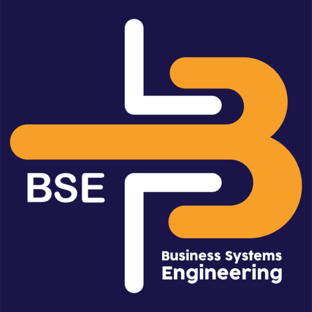

# BSE Documentation

  

Welcome to the internal documentation portal for **Business Systems Engineering (BSE)** — a leading Egyptian software development company specializing in ERP systems, e-invoicing, and custom software solutions since **2007**.

This site is the single source of truth for BSE engineering policies, trainings, and technical guides. For our public-facing products and services, visit [**bse.com.eg**](https://bse.com.eg/?utm_source=docs&utm_medium=docs-site&utm_campaign=bse-documentation).

## What you'll find here

- **[About BSE](about.md)** — Company overview, vision, mission, and how to reach us.
- **[Policy](policy.md)** — Internal engineering, data-handling, and documentation policies.
- **[Technical Guide](technical_guide.md)** — Implementation methodology, platform specifications, and best practices.
- **[Workflows](workflows/index.md)** — Step-by-step guides for recurring processes like managing website content, onboarding, and more.
- **[Framework](framework/index.md)** — Architecture decision records (ADRs), RFCs, and delivery plans for `Bse.Framework`, our modular .NET framework.

## Our Product Suite

BSE builds integrated, tax-invoice-ready ERP solutions deployed on the cloud or on customer infrastructure:

| Product | Purpose |
|---|---|
| **Safe Pack** | General-purpose integrated Web ERP |
| **Safe Batch** | Sophisticated integrated Web ERP |
| **Safe Orange** | Purchase management for fruits & vegetables |
| **Safe RS** | Real-estate rental & sales management |
| **Safe Block** | Cement block and ready-mix concrete production |
| **Safe PMS** | Full-cycle project management |
| **Safe Kids** | Member management for nurseries and hostels |
| **Safe University** | Management for universities, colleges, and institutes |

Learn more at [bse.com.eg](https://bse.com.eg/?utm_source=docs&utm_medium=docs-site&utm_campaign=bse-documentation&utm_content=products).

## What we offer

- **100%** integrated business solutions
- **95%** customizable and expandable
- **100%** post-sale customer service and support
- Proven track record driving measurable company growth

---

**For inquiries or support:** [info@bse.com.eg](mailto:info@bse.com.eg) · [+20 111 382 2999](tel:+201113822999) · [bse.com.eg/contact](https://bse.com.eg/?utm_source=docs&utm_medium=docs-site&utm_campaign=bse-documentation&utm_content=contact)
