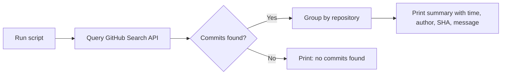

# Daily Commit Summary

This workflow generates a summary of all commits pushed to BSE GitHub repositories for a given day. It helps managers and team leads track daily progress across all projects without opening each repo individually.

---

## Quick reference

| I want to… | Command |
|---|---|
| See today's commits | `./scripts/daily-summary.sh` |
| See a specific date | `./scripts/daily-summary.sh 2026-04-14` |
| See the last 7 days | `./scripts/daily-summary.sh week` |

---

## Prerequisites

- [x] **GitHub CLI (`gh`)** installed — [installation guide](https://cli.github.com/)
- [x] **Authenticated** — run `gh auth login` once and follow the prompts
- [x] **jq** installed — comes with most Linux distros; on macOS: `brew install jq`; on Windows: `choco install jq` or `winget install jqlang.jq`
- [x] **Access** to the `Business-Systems-Engineering` GitHub org

---

## How it works



### What the script does (system steps)

1. **Calls the GitHub Search Commits API** with `org:Business-Systems-Engineering` and the target date range.
2. **Fetches up to 100 commits** in a single API call — no need to query each repo separately.
3. **Groups commits by repository** so you see all work on each project together.
4. **Sorts each group by time** (newest first) within each repo.
5. **Prints a formatted summary** showing time, author, short SHA, and first line of the commit message.

### What it does NOT do

- It does **not** push, pull, or modify any code.
- It does **not** store or cache results — every run is a fresh API query.
- It does **not** require cloning any repo locally.

---

## Running on Windows

### Option A — Git Bash (recommended)

Git for Windows ships with Git Bash, which runs bash scripts natively.

1. Open **Git Bash** (installed with [Git for Windows](https://git-scm.com/download/win)).
2. Navigate to the Documentation repo:
   ```bash
   cd /c/Projects/bse/Documentation
   ```
3. Run the script:
   ```bash
   ./scripts/daily-summary.sh
   ```

### Option B — PowerShell (without the script)

If you prefer not to use bash, run the equivalent `gh` command directly in PowerShell:

```powershell
# Today's commits
$today = Get-Date -Format "yyyy-MM-dd"
gh api search/commits -X GET `
  -f "q=org:Business-Systems-Engineering author-date:$today" `
  -f "sort=author-date" -f "order=desc" -f "per_page=100" `
  --jq '.items[] | "\(.commit.author.date | split("T")[1] | split(".")[0] | .[0:5])  \(.commit.author.name)  \(.sha[0:7])  \(.repository.full_name)  \(.commit.message | split("\n")[0])"'
```

### Option C — WSL (Windows Subsystem for Linux)

```bash
# Ensure gh is installed in WSL
sudo apt install gh
gh auth login

cd /mnt/c/Projects/bse/Documentation
./scripts/daily-summary.sh
```

---

## Running on Linux / macOS

```bash
cd ~/Projects/bse/Documentation
./scripts/daily-summary.sh          # today
./scripts/daily-summary.sh week     # last 7 days
./scripts/daily-summary.sh 2026-04-12  # specific date
```

---

## Example output

```
==========================================
 BSE Daily Commit Summary
 Scope : Business-Systems-Engineering
 Period : last 7 days (since 2026-04-08)
==========================================

## Business-Systems-Engineering/Documentation
------------------------------------------
  14:08  Mahrous     4d2822a  init workflow pages ++ website management page

## Business-Systems-Engineering/bse-api
------------------------------------------
  13:52  Mahrous     e1d42b9  fix(api): fix distributors public endpoint response shape
  12:21  Mahrous     c80ad1d  feat(api): add distributors table, CRUD routes, and public endpoint

## Business-Systems-Engineering/bse-brilliance-suite
------------------------------------------
  12:23  Mahrous     a9dd7f4  fix: distributors section RTL and Arabic language support
  17:37  Mahrous     0862b39  fix(admin): add missing submit button to DistributorEditor
  16:17  Mahrous     457200d  fix: set explicit text-sm on navbar links for consistent Chrome rendering

==========================================
 Total: 6 commit(s) across 3 repo(s)
==========================================
```

### Reading the output

| Column | Meaning |
|---|---|
| `14:08` | Time the commit was authored (local time of the author) |
| `Mahrous` | Git author name |
| `4d2822a` | Short SHA — click-free identifier, paste into `gh browse` or GitHub search |
| `init workflow pages...` | First line of the commit message — should describe **what** changed and **why** |

---

## Commit message conventions

For the summary to be useful, commit messages need to be descriptive. BSE follows the [Conventional Commits](https://www.conventionalcommits.org/) style:

| Prefix | When to use | Example |
|---|---|---|
| `feat:` | New feature | `feat: add distributors section to Contact page` |
| `fix:` | Bug fix | `fix: distributors RTL and Arabic language support` |
| `feat(scope):` | Feature in a specific area | `feat(admin): add DistributorEditor` |
| `fix(scope):` | Fix in a specific area | `fix(api): distributors public endpoint response shape` |
| `docs:` | Documentation only | `docs: add daily summary workflow` |
| `refactor:` | Code change that neither fixes a bug nor adds a feature | `refactor: extract partner taxonomy to shared lib` |
| `chore:` | Maintenance tasks | `chore: update dependencies` |

!!! tip "First line matters"
    The daily summary shows only the **first line** of each commit message. Keep it under 72 characters and make it describe the change, not the file.

---

## Troubleshooting

| Symptom | Cause | Fix |
|---|---|---|
| `gh: command not found` | GitHub CLI not installed | Install from [cli.github.com](https://cli.github.com/) |
| `gh: not logged in` | Not authenticated | Run `gh auth login` |
| `jq: command not found` | jq not installed | `brew install jq` (mac) / `choco install jq` (win) / `apt install jq` (linux) |
| No commits shown but you pushed today | API index delay | Wait 1–2 minutes; GitHub indexes commits asynchronously |
| TLS handshake timeout | Network issue | Check VPN/proxy settings; retry |
| Only 100 commits shown | API page limit | The script fetches one page of 100; for busier orgs, extend with `--paginate` |
