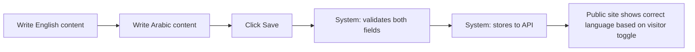
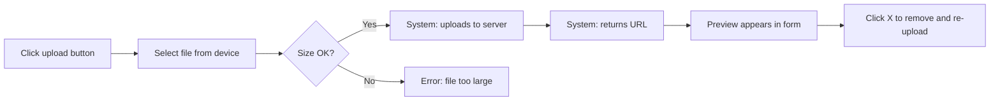

# Managing Website Content (bse.com.eg)

This workflow covers every content management task on the BSE public website. It is the single reference for anyone who needs to add, edit, or remove content — whether you are a new joiner or a senior team member.

---

## Quick reference — "I want to change…"

Use this table to jump straight to the section you need.

| I want to… | Go to section |
|---|---|
| Update the homepage hero text or call-to-action buttons | [Homepage hero](#homepage-hero) |
| Add or edit a product / service | [Services](#services) |
| Publish a news article or event | [News & articles](#news-articles) |
| Add a partner or update their logo | [Partners](#partners) |
| Add a distributor | [Distributors](#distributors) |
| Upload a document to the Technical Library | [Technical Library](#technical-library) |
| Upload a Business Solution document | [Business Solutions library](#business-solutions-library) |
| Edit the About page (story, vision, mission, team) | [About page](#about-page) |
| Update contact information, address, or map | [Contact information](#contact-information) |
| Manage customer testimonials | [Testimonials](#testimonials) |
| Update translations (Arabic / English) | [Translations](#translations) |
| Change the site logo or branding | [Global content & branding](#global-content-branding) |
| Review form submissions from visitors | [Submissions](#submissions) |
| Manage admin users and roles | [Users & roles](#users-roles) |

---

## Prerequisites

Before you begin any content task, make sure you have:

- [x] An admin account — ask your manager or an existing admin to create one.
- [x] Access to the admin panel at `https://bse.com.eg/admin`.
- [x] Your assigned role:

| Role | Can read | Can create | Can edit | Can delete | Can manage users & settings |
|---|---|---|---|---|---|
| **Admin** | Yes | Yes | Yes | Yes | Yes |
| **Editor** | Yes | Yes | Yes | No | No |
| **Viewer** | Yes | No | No | No | No |

---

## Logging in

### Steps

1. Open `https://bse.com.eg/admin/login` in your browser.
2. Enter your **email** and **password**.
3. Click **Login**.
4. **System:** authenticates your credentials, stores a session token, and redirects you to the admin dashboard.

### After login

- The **sidebar** on the left lists all content sections you have permission to access.
- The **header** bar shows: search (++ctrl+k++ or ++cmd+k++), theme toggle, notifications bell, and your profile menu.
- Use ++ctrl+k++ / ++cmd+k++ at any time to open the **Command Palette** for quick navigation.

!!! tip "Keyboard shortcut"
    Press ++ctrl+k++ (Windows/Linux) or ++cmd+k++ (Mac) anywhere in the admin panel to instantly jump to any page or create new content.

---

## Understanding bilingual content

Every piece of public-facing text on bse.com.eg exists in **two languages**: English and Arabic. When you edit content, you will see side-by-side input fields:

| Left column | Right column |
|---|---|
| **English** (left-to-right) | **العربية** (right-to-left) |

**Both fields are required** for any content that appears on the public site. If you leave one empty, visitors switching to that language will see a blank section.

### Process

!!! warning "Translation is manual"
    The system does **not** auto-translate. Each language version must be written separately. If you are not fluent in Arabic, coordinate with a bilingual colleague before publishing.

---

## Content workflows

### Homepage hero

The hero is the large banner at the top of the homepage with the main headline, rotating industry words, and call-to-action buttons.

**Admin path:** Sidebar → **Homepage**

#### What you can edit

| Field | Description | Bilingual |
|---|---|---|
| Badge text | Small label above the headline (e.g. "Since 2007") | Yes |
| Title | Main headline text | Yes |
| Description | Subtitle paragraph below the headline | Yes |
| Rotating words | Industry words that cycle in the headline (e.g. "ERP", "E-Invoicing") | Yes |
| Primary CTA | Main button text and link (e.g. "Explore Systems" → `/services`) | Yes |
| Secondary CTA | Second button text and link (e.g. "Request Demo" → `/contact`) | Yes |
| Trusted badge | Trust indicator text (e.g. "500+ companies") | Yes |

#### Steps

1. Navigate to **Homepage** in the sidebar.
2. Edit any of the fields listed above. Each has English and Arabic inputs side by side.
3. For **rotating words**, enter each word on a separate line or as a comma-separated list (check the current format in the field).
4. Click **Save** (or press ++ctrl+s++).
5. **System:** invalidates the homepage cache → public site reflects changes on next page load.

#### What the system does automatically

- Rotating words cycle every **2.5 seconds** on the public site with a fade animation.
- If the API returns empty data, the site falls back to hardcoded default text — your saved content always takes priority over fallback.
- The 3D background scene behind the hero loads independently and does not need content configuration.

---

### Services

Services are the core product offerings displayed on the `/services` page and in individual detail pages (`/services/{id}`).

**Admin path:** Sidebar → **Systems** → select a category (ERP, Business, E-Invoice, Mobile Apps, Others)

#### What you can edit per service

| Field | Description | Bilingual |
|---|---|---|
| Name | Product name (e.g. "Safe Pack") | Yes |
| Tagline | Short one-line description | Yes |
| Description | Full product description | Yes |
| Category | One of: `erp`, `einvoice`, `business`, `mobile`, `others` | No |
| Logo / Icon | Product logo or icon image | No |
| Icon background color | Hex color for the icon badge | No |
| Details | Extended description for the detail page | Yes |
| Target customers | Who this product is for | Yes |
| Modules | List of modules/features (one per line) | Yes |
| Features | Key feature bullet points | Yes |
| Benefits | Business benefit bullet points | Yes |

#### Steps — adding a new service

1. Sidebar → **Systems** → select the appropriate category tab.
2. Click **+ New System** (or use ++ctrl+k++ → "New System").
3. Fill in all fields. Pay attention to:
      - **Category** must match one of the five predefined categories.
      - **Logo** — click the upload button, select an image (max **5 MB**, formats: JPG, PNG, WebP, SVG).
      - **Modules, Features, Benefits** — enter each item on a separate line.
4. Fill in both English and Arabic fields for all bilingual inputs.
5. Click **Create**.
6. **System:** saves the service → invalidates the services cache → the new service appears on:
      - The `/services` page under its category tab.
      - The homepage "Featured Systems" grid (if it's among the featured items).
      - The header navigation dropdown under its category.

#### Steps — editing an existing service

1. Sidebar → **Systems** → find the service in the list.
2. Click the service row to open the editor.
3. Make your changes.
4. Click **Save Changes** (or ++ctrl+s++).
5. **System:** updates the service → the detail page at `/services/{id}` reflects changes on next load.

!!! info "Service categories in navigation"
    The five category tabs (ERP, Business, E-Invoice, Mobile Apps, Others) are hardcoded in the website header navigation. Adding a new **category** requires a code change — talk to the development team. Adding a new **service within an existing category** does not.

---

### News & articles

News articles appear on the `/news` page, organized by category, and each article has its own page at `/news/{slug}`.

**Admin path:** Sidebar → **News**

#### What you can edit per article

| Field | Description | Bilingual |
|---|---|---|
| Title | Article headline | Yes |
| Slug | URL-friendly identifier (auto-generated from title) | No |
| Excerpt | Short summary shown on the news listing | Yes |
| Content | Full article body (supports HTML/markdown) | Yes |
| Category | One of: `bse` (BSE News), `updates`, `events` | No |
| Author | Author name | Yes |
| Date | Publication date | No |
| Image | Hero/thumbnail image for the article | No |
| Tags | Comma-separated tags for the article | No |

#### Steps — publishing a new article

1. Sidebar → **News** → click **+ New Article** (or ++ctrl+k++ → "New Article").
2. Fill in the **Title** (English and Arabic). The **slug** is auto-generated from the English title.
3. Write the **Excerpt** — this is what appears on the news listing page as a preview.
4. Write the **Content** in both languages. You can use HTML for formatting (bold, links, headings, lists).
5. Select a **Category**:
      - `bse` → appears under the "BSE News" tab
      - `updates` → appears under the "Updates" tab
      - `events` → appears under the "Events" tab
6. Set the **Date** and **Author**.
7. Upload a **hero image** (max 5 MB).
8. Add **Tags** for discoverability.
9. Click **Create** to save as draft.
10. Click **Publish** to make it live on the public site.
11. **System:** the article appears on `/news`, is filterable by category, and has its own page at `/news/{slug}`.

#### Steps — unpublishing an article

1. Open the article from the news list.
2. Click **Unpublish**.
3. **System:** removes the article from the public news listing. The slug URL returns a 404.

#### What the system does automatically

- **Related articles:** the article page sidebar shows up to 2 articles from the same category.
- **Share button:** visitors can share the article via the browser's native share dialog or copy the link.
- **Newsletter sidebar:** the news page includes a newsletter signup form — subscribers are managed automatically via the API.

!!! warning "HTML content"
    Article content is rendered as HTML on the public site. Be careful with formatting — unclosed tags can break the page layout. Preview your article after publishing.

---

### Partners

Partners are organizations displayed on the `/partners` page with their logo, sector, country, and year of partnership.

**Admin path:** Sidebar → **Partners**

#### What you can edit per partner

| Field | Description | Bilingual |
|---|---|---|
| Name | Partner organization name | Yes |
| Logo | Partner logo image | No |
| Sector | Industry sector (from predefined taxonomy) | No (label is bilingual) |
| Country | Country (from predefined taxonomy) | No (label is bilingual) |
| Year | Year of partnership | No |

#### Steps — adding a new partner

1. Sidebar → **Partners** → click **+ New Partner** (or ++ctrl+k++ → "New Partner").
2. Enter the **Name** in English and Arabic.
3. Upload the **Logo** (max 5 MB; JPG, PNG, WebP, SVG).
4. Select **Sector** from the dropdown (sectors are predefined in the partner taxonomy — e.g. banking, healthcare, government, retail).
5. Select **Country** from the dropdown.
6. Enter the **Year** of partnership.
7. Click **Create**.
8. **System:** the partner appears on:
      - The `/partners` page grid (filterable by sector, year, country).
      - The homepage partners marquee/carousel.

#### What the system does automatically

- The homepage **partner carousel** automatically includes all partners and scrolls infinitely, pausing on hover.
- The `/partners` page provides **filter dropdowns** (Sector, Year, Country) — these are populated automatically from the data you enter.
- Sector and country **labels** are automatically displayed in the correct language based on the visitor's language toggle. The taxonomy file maps each value to both an English and Arabic label.

!!! note "Adding a new sector or country"
    The sector and country dropdown options are defined in a shared taxonomy file (`/lib/partners-taxonomy`). Adding a new option requires a code change — coordinate with the development team.

---

### Distributors

Distributors are displayed on the Contact page in a dedicated section.

**Admin path:** Sidebar → **Distributors**

#### What you can edit per distributor

| Field | Description | Bilingual |
|---|---|---|
| Name | Distributor name | Yes |
| Region | Geographic region or governorate | Yes |
| Phone | Contact phone number | No |
| Email | Contact email | No |
| Address | Physical address | Yes |
| Logo | Distributor logo image | No |

#### Steps — adding a new distributor

1. Sidebar → **Distributors** → click **+ New Distributor** (or ++ctrl+k++ → "New Distributor").
2. Fill in all fields with English and Arabic where required.
3. Upload a **Logo** if available.
4. Click **Create**.
5. **System:** the distributor appears on the Contact page (`/contact`) in the distributors section.

---

### Technical Library

The Technical Library (`/library`) hosts downloadable technical documents — product datasheets, technical guides, whitepapers, and similar resources.

**Admin path:** Sidebar → **Library**

#### What you can edit per document

| Field | Description | Bilingual |
|---|---|---|
| Title | Document title | Yes |
| Description | Brief summary of the document | Yes |
| Type | Must be `technical` for this library | No |
| Category | From predefined categories (managed separately) | No |
| File | The downloadable file (PDF, DOCX, etc.) | No |
| Thumbnail | Preview image / cover | No |
| Year | Publication year | No |
| Industry | Target industry | Yes |

#### Steps — uploading a new document

1. Sidebar → **Library** → click **+ New Document**.
2. Set **Type** to `technical`.
3. Enter the **Title** and **Description** in both English and Arabic.
4. Select a **Category** from the dropdown (categories are managed under **Library Categories** — see below).
5. Upload the **File** (max 10 MB).
6. Upload a **Thumbnail** image (max 5 MB).
7. Set the **Year** and **Industry**.
8. Click **Create**.
9. **System:** the document appears on `/library`, filterable by category, year, and searchable by title/description.

#### What the system does automatically

- **Download tracking:** every time a visitor clicks the download link, the system records the event via the API. The most-downloaded documents surface in the "Popular Downloads" sidebar.
- **Recently added:** the sidebar also shows the most recently uploaded documents.
- **Search:** visitors can search by title, description, industry, or category name.
- **Pagination:** documents are paginated automatically when the list exceeds one page.

---

### Business Solutions library

Identical in structure to the Technical Library, but documents appear on the `/solutions` (Business Solutions) page instead.

**Admin path:** Sidebar → **Library** (same as Technical Library)

#### Steps — uploading a Business Solutions document

Follow the same steps as [Technical Library](#technical-library), but set **Type** to `business` instead of `technical`.

**System:** the document appears on the `/solutions` page. The header navigation dropdown under "Business Solutions" automatically lists all categories that have at least one document of type `business`.

!!! tip "Categories drive navigation"
    Business Solution categories appear as dropdown items in the website's top navigation bar. When you create a new category and assign at least one `business` document to it, a new dropdown link appears automatically.

---

### Managing library categories

Categories organize documents in both the Technical Library and Business Solutions sections.

**Admin path:** Sidebar → **Library Categories**

#### Steps — creating a new category

1. Sidebar → **Library Categories**.
2. Click **+ New Category**.
3. Enter the **Name** in English and Arabic.
4. Enter a **Slug** (URL-friendly identifier, e.g. `erp-solutions`).
5. Set the **Sort Order** (lower numbers appear first).
6. Set the **Type** — `technical` or `business` (determines which library the category belongs to).
7. Click **Create**.
8. **System:** the category becomes available as a filter option on the relevant library page. For `business` type categories, a new dropdown link also appears in the header navigation.

---

### About page

The About page (`/about`) contains the company story, vision, mission, values, team profiles, timeline, and certificates.

**Admin path:** Sidebar → **About Page**

#### Sections you can edit

| Section | Fields | Bilingual |
|---|---|---|
| **Story** | Title, body text | Yes |
| **Vision** | Title, description | Yes |
| **Mission** | Title, description | Yes |
| **Values** | Icon name, title, description, display order (per value item) | Yes |
| **Timeline** | Year, title, display order (per milestone) | Yes |
| **Team** | Avatar image, name, role, bio (per member) | Yes |

#### Steps — editing the company story

1. Sidebar → **About Page**.
2. Find the **Story** section.
3. Edit the **Title** and **Body** in both English and Arabic.
4. Click **Save**.
5. **System:** updates the about page story section.

#### Steps — adding a team member

1. Sidebar → **About Page** → scroll to the **Team** section.
2. Click **+ Add Member**.
3. Upload an **Avatar** image.
4. Enter the member's **Name**, **Role**, and **Bio** in both languages.
5. Click **Save**.
6. **System:** the new team member appears in the leadership section of the about page.

#### Steps — adding a value

1. Sidebar → **About Page** → scroll to the **Values** section.
2. Click **+ Add Value**.
3. Select an **Icon** name (uses Lucide icon set — see the [Lucide icon gallery](https://lucide.dev/icons/) for available names).
4. Enter the **Title** and **Description** in both languages.
5. Set the **Order** number (lower = appears first).
6. Click **Save**.

---

### Contact information

Contact details appear on the `/contact` page and in the site footer on every page.

**Admin path:** Sidebar → **Global Content** (contact section)

#### What you can edit

| Field | Description | Bilingual |
|---|---|---|
| Address | Office physical address | Yes |
| Phone | Main phone number | No |
| Email | General contact email | No |
| Map embed URL | Google Maps embed iframe URL | No |
| Social links | Facebook, Instagram, X, LinkedIn, YouTube, GitHub URLs | No |

#### Steps

1. Sidebar → **Global Content**.
2. Find the **Contact** section.
3. Update any field. Remember to fill in the address in **both languages**.
4. Click **Save**.
5. **System:** updates the `/contact` page and the site footer simultaneously — both pull from the same data source.

!!! info "Fallback contact info"
    If the API is unreachable, the public site displays hardcoded fallback contact info (the original Giza office address, phone, and email). To change the fallback, a code change is needed.

---

### Testimonials

Customer testimonials appear on the homepage and may appear on other pages.

**Admin path:** Sidebar → **Testimonials**

#### What you can edit per testimonial

| Field | Description | Bilingual |
|---|---|---|
| Quote | The testimonial text | Yes |
| Author name | Customer name | Yes |
| Company | Customer's company name | Yes |
| Rating | Star rating (1–5) | No |
| Avatar | Customer photo | No |

#### Steps — adding a testimonial

1. Sidebar → **Testimonials** → click **+ Add Testimonial**.
2. Enter the **Quote** in both English and Arabic.
3. Enter the **Author** and **Company** in both languages.
4. Set a **Rating** (1–5 stars).
5. Upload an **Avatar** photo if available.
6. Click **Create**.
7. **System:** the testimonial appears on the homepage testimonials section (if testimonials exist, the section renders automatically).

---

### Translations

The translation manager controls all **static UI text** on the public site — navigation labels, button text, form labels, footer text, and other interface strings.

**Admin path:** Sidebar → **Translations**

!!! warning "This is NOT for page content"
    Translations manage **UI strings** (e.g. "Read More", "Contact Us", "Submit"). Page content (articles, service descriptions, etc.) is managed in their respective editors with bilingual fields.

#### Steps — updating a translation

1. Sidebar → **Translations**.
2. Use the **search** to find the translation key (e.g. `nav.services`, `footer.copyright`).
3. Edit the **English** and/or **Arabic** value.
4. Click **Save**.
5. **System:** the updated string appears everywhere that key is used on the public site.

#### When to use translations vs. content editors

| Scenario | Use |
|---|---|
| Change the navigation label "Services" to "Our Systems" | **Translations** (`nav.services`) |
| Change the description of Safe Pack | **Service Editor** |
| Change "Subscribe to Newsletter" button text | **Translations** |
| Add a new news article | **News Editor** |

---

### Global content & branding

Global content controls site-wide elements: the logo, branding assets, and shared content blocks.

**Admin path:** Sidebar → **Global Content**

#### What you can edit

| Field | Description |
|---|---|
| Light logo | Logo used on light backgrounds and in the header |
| Dark logo | Logo used on dark backgrounds and in the footer |
| Site title | Browser tab title prefix |

#### Steps — updating the logo

1. Sidebar → **Global Content**.
2. Upload the new **Light logo** and/or **Dark logo** (max 5 MB; SVG or PNG recommended for crisp rendering).
3. Click **Save**.
4. **System:** the header and footer logos update across all pages. The header automatically switches between light and dark logo based on scroll position and theme.

---

### Submissions

Visitors submit inquiries through forms on the Contact page and the Partners page. These submissions are collected in the admin panel for review.

**Admin path:** Sidebar → **Submissions**

#### Types of submissions

| Source | Form fields |
|---|---|
| **Contact form** (`/contact`) | Name, email, phone, message, (optional: pre-selected service) |
| **Partner inquiry form** (`/partners`) | Name, company, address, governorate, contact, field, branches, program |

#### Steps — reviewing submissions

1. Sidebar → **Submissions**.
2. The list shows all incoming submissions, newest first.
3. Click a submission to view full details.
4. Take the appropriate action outside the system (call the lead, forward to sales, etc.).

!!! tip "Service pre-fill"
    When a visitor clicks "Request a Quote" from a service detail page, the contact form pre-fills with that service name in the message field. You'll see which product the lead is interested in.

---

### Users & roles

Manage who has access to the admin panel and what they can do.

**Admin path:** Sidebar → **Users** (admin role required)

#### Steps — creating a new admin user

1. Sidebar → **Users** → click **+ New User** (or ++ctrl+k++ → "New User").
2. Enter the user's **Name** and **Email**.
3. Set a temporary **Password**.
4. Assign a **Role**:
      - **Admin** — full access including user management, settings, analytics, and audit logs.
      - **Editor** — can create and edit content but cannot delete or manage users.
      - **Viewer** — read-only access to all content sections.
5. Click **Create**.
6. Share the credentials with the new user and instruct them to change their password on first login.

---

## Image and file upload guidelines

All image and file uploads across the admin panel follow these constraints:

| Type | Max size | Accepted formats |
|---|---|---|
| **Images** | 5 MB | JPG, PNG, WebP, SVG |
| **Files** (documents) | 10 MB | PDF, DOCX, XLSX, and other document formats |

### Upload process

!!! tip "Google Drive images"
    You can also paste a Google Drive sharing URL in the image URL field — the system automatically converts it to a direct image link.

---

## System behaviors & data sync

Understanding what happens automatically helps you trust the system and troubleshoot when something doesn't appear as expected.

### Cache invalidation

When you save content in the admin panel:

1. **System:** writes data to the API.
2. **System:** invalidates the relevant React Query cache (e.g. all services, or a specific article).
3. **Public site:** on the next visitor page load, fresh data is fetched from the API.

There is no manual "clear cache" step. Changes typically appear within seconds.

### Fallback data

Every public page has **hardcoded fallback content** that displays if the API is unreachable. This means:

- The site never shows a blank page — there's always baseline content.
- Your API-saved content **always takes priority** over fallback when the API is up.
- If you notice the site showing old/default content despite your edits, the API may be down — check with the development team.

### Newsletter subscriptions

The newsletter signup form appears in two places (News page sidebar + Footer). Both call the same API endpoint. Subscriber data is stored server-side — there is no admin UI to manage subscribers yet.

### SEO metadata

Each page automatically generates SEO metadata (title, description, canonical URL, schema markup) based on the content you enter. You do not need to manage SEO fields separately.

---

## End-to-end example: publishing a news article

This walkthrough ties together multiple workflows to show the complete process.

### Scenario

You want to publish an article announcing a new partnership with "Cairo National Bank".

### Steps

| # | Actor | Action |
|---|---|---|
| 1 | **You** | Log in to `bse.com.eg/admin` |
| 2 | **You** | First, add the partner: Sidebar → **Partners** → **+ New Partner** |
| 3 | **You** | Fill in: Name (EN: "Cairo National Bank", AR: "بنك القاهرة الوطني"), upload logo, select Sector: "Banking", Country: "Egypt", Year: "2026" |
| 4 | **You** | Click **Create** |
| 5 | **System** | Partner saved → appears on `/partners` page and homepage carousel |
| 6 | **You** | Now write the article: Sidebar → **News** → **+ New Article** |
| 7 | **You** | Fill in Title, Excerpt, Content in both languages. Set Category: `bse`, Date: today, upload a hero image |
| 8 | **You** | Click **Create** (saves as draft) |
| 9 | **You** | Review the content — check both English and Arabic versions |
| 10 | **You** | Click **Publish** |
| 11 | **System** | Article goes live at `/news/{slug}` |
| 12 | **System** | Article appears in the "BSE News" tab on `/news` |
| 13 | **System** | Related articles sidebar updates to include this article for same-category pieces |
| 14 | **Visitors** | Can read, share, and see the partner on the partners page |

---

## Troubleshooting

| Symptom | Likely cause | Resolution |
|---|---|---|
| Changes don't appear on the public site | Browser cache or API latency | Hard-refresh the page (++ctrl+shift+r++) or wait 30 seconds |
| Image upload fails | File exceeds 5 MB or unsupported format | Resize/convert the image and try again |
| "Permission denied" error | Your role lacks the required permission | Ask an admin to upgrade your role or perform the action for you |
| Content shows in English but not Arabic (or vice versa) | The other language field was left empty | Edit the content and fill in the missing language |
| A new partner doesn't appear on the homepage carousel | The homepage may need a refresh or the partner was just added | Wait a few seconds and refresh. The carousel auto-includes all partners |
| Service category dropdown is missing an option | Categories are hardcoded | Request a code change from the development team |
| Library category not appearing in header dropdown | No documents assigned to that category yet, or type is `technical` not `business` | Assign at least one `business` document to the category |

---

## Audit trail

All content changes are logged automatically.

**Admin path:** Sidebar → **Audit Logs** (admin role required)

The audit log records:

- **Who** made the change (user name and email).
- **What** was changed (resource type, action: create/update/delete).
- **When** the change was made (timestamp).

Use audit logs to trace who published a specific article, when a partner was added, or if content was accidentally deleted.

---

## Analytics

The admin dashboard provides analytics on website traffic and content performance.

**Admin path:** Sidebar → **Analytics** (admin and editor roles)

Available metrics:

- **Dashboard stats** — visitor counts, page views, top pages.
- **Traffic data** — trends over time.
- **Top pages** — which pages get the most visits.
- **Download tracking** — which library documents are downloaded most frequently.
