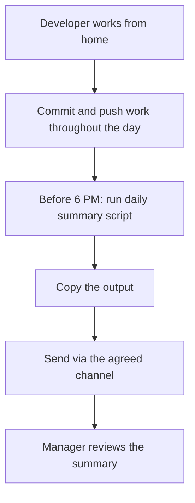

# Work-From-Home Daily Report

Every developer working from home must submit a daily report **before 6:00 PM (Cairo time)** on each working day. The report is generated automatically from your Git commits using the daily summary script — it takes less than a minute.

---

## Why this matters

- **Visibility** — managers can see progress without interrupting your flow.
- **Accountability** — a commit-backed report is objective, not subjective.
- **Sync** — the team knows what changed across all repos by end of day.
- **New joiners** — following this process from day one builds good habits.

---

## The rule

!!! warning "Mandatory for all WFH days"
    If you are working from home, you **must** submit your daily report before **6:00 PM Cairo time**. No exceptions. If you have no commits for the day, report that explicitly with a brief note on what you worked on (research, meetings, reviews, etc.).

---

## Process overview



| Step | Actor | Deadline |
|---|---|---|
| Commit and push regularly | Developer | Throughout the day |
| Run the daily summary script | Developer | Before 6:00 PM |
| Send the report | Developer | Before 6:00 PM |
| Review | Manager | End of day |

---

## Step-by-step: generating your report

### On Windows (primary instructions)

#### Option 1 — Git Bash (recommended)

Git Bash comes pre-installed with [Git for Windows](https://git-scm.com/download/win). It is the easiest way to run the script.

**First-time setup (once only):**

1. **Install Git for Windows** if you haven't already — download from [git-scm.com](https://git-scm.com/download/win) and run the installer with default settings.

2. **Install GitHub CLI:**
    - Download from [cli.github.com](https://cli.github.com/) and run the installer.
    - Or via winget:
      ```
      winget install GitHub.cli
      ```

3. **Install jq:**
    - Download from [jqlang.github.io/jq](https://jqlang.github.io/jq/download/) — get the Windows 64-bit binary.
    - Rename it to `jq.exe` and place it in `C:\Program Files\Git\usr\bin\` (so Git Bash can find it).
    - Or via chocolatey:
      ```
      choco install jq
      ```

4. **Authenticate GitHub CLI:**
    - Open **Git Bash** and run:
      ```bash
      gh auth login
      ```
    - Select **GitHub.com** → **HTTPS** → **Login with a web browser**.
    - Follow the prompts to complete authentication.

5. **Clone the DevUtiles repo** (if not already cloned):
    ```bash
    cd /c/Projects/bse
    git clone git@github.com:Business-Systems-Engineering/DevUtiles.git
    ```

    See [Daily Commit Summary → Initial setup](daily-commit-summary.md#initial-setup) for Linux/macOS paths and an optional "add to PATH" step.

**Daily usage:**

1. Open **Git Bash** (search "Git Bash" in the Start menu).
2. Run:
    ```bash
    cd /c/Projects/bse/DevUtiles
    ./daily-summary.sh
    ```
3. The summary prints to your terminal. Select all text (++ctrl+a++) and copy (right-click → Copy, or ++ctrl+ins++).
4. Paste into the agreed reporting channel.

#### Option 2 — PowerShell (no bash needed)

If you cannot use Git Bash, run this in **PowerShell** or **Windows Terminal**:

```powershell
# --- First-time setup (run once) ---
# Install GitHub CLI and jq if not already installed:
# winget install GitHub.cli
# winget install jqlang.jq
# gh auth login

# --- Daily usage ---
$today = Get-Date -Format "yyyy-MM-dd"

Write-Host "==========================================" -ForegroundColor Cyan
Write-Host " BSE Daily Report - $today" -ForegroundColor Cyan
Write-Host "==========================================" -ForegroundColor Cyan
Write-Host ""

gh api search/commits -X GET `
  -f "q=org:Business-Systems-Engineering author-date:$today" `
  -f "sort=author-date" `
  -f "order=desc" `
  -f "per_page=100" `
  --jq '.items[] | "\(.commit.author.date | split("T")[1] | split("+")[0] | .[0:5])  \(.commit.author.name | .[0:10])  \(.sha[0:7])  \(.repository.name)  \(.commit.message | split("\n")[0])"'

Write-Host ""
Write-Host "==========================================" -ForegroundColor Cyan
```

**To make this a one-click shortcut:**

1. Save the above as `C:\Projects\bse\daily-report.ps1`.
2. Right-click your desktop → **New** → **Shortcut**.
3. Enter: `powershell -ExecutionPolicy Bypass -File "C:\Projects\bse\daily-report.ps1" -NoExit`
4. Name it "BSE Daily Report".
5. Double-click the shortcut each day before 6 PM.

#### Option 3 — WSL (Windows Subsystem for Linux)

```bash
# First-time setup
sudo apt update && sudo apt install -y gh jq
gh auth login

cd /mnt/c/Projects/bse/DevUtiles
./daily-summary.sh
```

---

### On Linux

```bash
# First-time setup (Ubuntu/Debian)
sudo apt install -y gh jq
gh auth login

# Clone DevUtiles if needed
cd ~/Projects/bse
git clone git@github.com:Business-Systems-Engineering/DevUtiles.git
chmod +x DevUtiles/daily-summary.sh

# Daily usage
cd ~/Projects/bse/DevUtiles
./daily-summary.sh
```

---

### On macOS

```bash
# First-time setup
brew install gh jq
gh auth login

# Clone DevUtiles if needed
cd ~/Projects/bse
git clone git@github.com:Business-Systems-Engineering/DevUtiles.git
chmod +x DevUtiles/daily-summary.sh

# Daily usage
cd ~/Projects/bse/DevUtiles
./daily-summary.sh
```

---

## What to report when you have no commits

Some days involve work that doesn't produce commits — code reviews, meetings, research, design discussions, debugging without a fix yet. On those days, send a brief text report instead:

```
==========================================
 BSE Daily Report — 2026-04-15
==========================================

No commits today.

Work summary:
- Reviewed PR #42 on bse-api (distributors endpoint)
- Attended architecture meeting re: notification service
- Researching Redis Streams patterns for event sourcing
==========================================
```

!!! info "The goal is visibility, not micromanagement"
    The report exists so the team knows what happened today. A "no commits" report with context is perfectly fine — an unreported day is not.

---

## Commit best practices for better reports

Your daily report is only as useful as your commit messages. Follow these practices:

### Do

- **Commit often** — small, focused commits make the summary readable.
- **Use conventional prefixes** — `feat:`, `fix:`, `docs:`, `refactor:`, `chore:`.
- **Push before running the script** — the summary reads from GitHub, not your local machine.
- **Write the first line for humans** — it should answer "what did this change do?"

### Don't

- Don't batch a whole day's work into one giant commit.
- Don't use generic messages like "updates", "fixes", "WIP".
- Don't forget to push — unpushed commits won't appear in the report.

| Bad message | Better message |
|---|---|
| `fix` | `fix: prevent null pointer in partner sector filter` |
| `updates` | `feat(admin): add bulk delete to news manager` |
| `WIP` | `wip: distributor import — CSV parsing done, validation next` |
| `stuff` | `refactor: extract taxonomy constants to shared module` |

---

## Checklist — end of WFH day

Use this checklist every WFH day before 6 PM:

- [ ] All work committed with descriptive messages
- [ ] All commits pushed to GitHub
- [ ] Run `./daily-summary.sh` from the DevUtiles repo (or the PowerShell equivalent)
- [ ] Copy output and send to the agreed channel
- [ ] If no commits: write a brief text summary instead

---

## Troubleshooting

| Problem | Solution |
|---|---|
| `gh: command not found` | Install GitHub CLI — see [First-time setup](#option-1-git-bash-recommended) |
| `jq: command not found` | Install jq — see [First-time setup](#option-1-git-bash-recommended) |
| Script shows no commits but you pushed today | GitHub indexes commits asynchronously — wait 1–2 minutes and retry |
| Commits show under wrong author name | Check `git config user.name` — it should match your expected name |
| Can't run `.sh` files on Windows | Use Git Bash (not CMD or PowerShell) — or use the PowerShell version above |
| Permission denied when running the script | Run `chmod +x daily-summary.sh` inside the DevUtiles repo |
| Clone succeeded but script is missing | The DevUtiles repo changed — run `git pull` inside the DevUtiles folder |
| Report shows commits from other days | Check your system clock and timezone; the script uses your local date |
