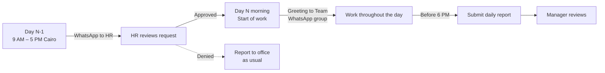

# Work-From-Home Policy

Working from home is a privilege at BSE, not a default. This policy defines the **four-step process** every employee must follow: **request → approval → morning check-in → end-of-day report**. Skipping any step counts as an unauthorised absence.

!!! info "Working hours"
    BSE working hours are **9:00 AM – 5:00 PM (Africa/Cairo, UTC+2)**. Anywhere this policy says "working hours" or "during working hours", it means this window.

!!! warning "When WFH is appropriate"
    WFH is for **focused delivery work** — you have a task that needs concentration, and you can deliver it on time by working from home instead of the office. You are expected to be **working the full 9 AM – 5 PM day**, reachable on WhatsApp / Teams / email, and producing output (commits, documents, decisions) just like any office day.

    WFH is **not**:

    - A substitute for annual leave, sick leave, or time off.
    - Cover for appointments, errands, or family obligations that take you away from work during working hours.
    - A "half-day" or reduced-hours arrangement.

    If you can't work the full day — for any reason — request the appropriate leave through HR instead. Mixing leave into a WFH day is dishonest and counts as an unauthorised absence.

---

## Why this matters

- **Predictability** — managers plan coverage and meetings around who's in the office.
- **Visibility** — the team sees who's working, from where, without needing to ask.
- **Accountability** — a commit-backed report is objective, not subjective.
- **Fairness** — the same process for everyone, every time.

---

## The full process at a glance



| # | Step | When | Actor | Channel |
|---|---|---|---|---|
| 1 | [Request WFH](#step-1-request-wfh-day-n-1) | One day before, **9 AM – 5 PM Cairo** | Employee → HR | WhatsApp (direct) |
| 2 | [Receive approval](#step-2-approval) | Same day, before end of business | HR → Employee | WhatsApp (direct) |
| 3 | [Morning check-in](#step-3-morning-check-in) | The moment you start work on the WFH day | Employee → Team | WhatsApp group: **BSE Team** |
| 4 | [Submit daily report](#step-4-submit-daily-report) | Before 6:00 PM Cairo time | Employee → Team | WhatsApp group: **BSE Team** (or channel agreed with your manager) |

---

## Step 1 — Request WFH (day N-1)

Contact **HR via WhatsApp** on the day before you want to work from home, **between 9:00 AM and 5:00 PM Cairo time**. Include:

- The date you're requesting (e.g. "tomorrow, 17 April").
- The **task you plan to deliver** — WFH is granted for focused delivery work, so tell HR what you'll be working on and, ideally, when it'll land.

!!! warning "Timing matters"
    Requests sent outside the 9 AM – 5 PM window, or on the morning of the WFH day itself, are **not** guaranteed to be reviewed. If HR hasn't approved before you start the day, you are expected to be in the office.

### Example message

> Good morning, I'd like to request to work from home tomorrow (Thursday, 17 April). I need to finish the distributor-import feature — it needs a long focused block, and I can deliver it by end of day from home. Thanks!

---

## Step 2 — Approval

!!! danger "Core rule: no reply = no approval"
    Only an **explicit "yes" from HR** entitles you to work from home. Silence, "I'll check", read receipts, or a thumbs-up emoji **do not count**. If HR has not clearly approved by end of the request day (5 PM Cairo), you report to the office the next morning as usual.

!!! info "HR response-time target"
    HR **aims to reply within 2 hours during working hours** (9 AM – 5 PM Cairo). If your request has been pending longer than that, a polite follow-up is appropriate. If HR still hasn't replied as 5 PM approaches, treat it as a no and plan to be in the office.

HR reviews the request and replies on WhatsApp. The table below shows how to interpret the response:

| HR reply | Means |
|---|---|
| "Approved", "OK", "Yes", or equivalent explicit confirmation | You may work from home the next day |
| "Not this time", "Please come in" | You are expected in the office |
| No reply by 5 PM Cairo on the request day | No approval — report to the office |
| Ambiguous reply ("I'll let you know", "maybe", "later") | Follow up; still counts as no approval until explicit |

If your request is denied or HR doesn't respond by end of day, you report to the office as normal.

### Escalation — HR unavailable

If HR is genuinely unreachable (off sick, phone unavailable, etc.), post your request in the **BSE Team** WhatsApp group. A manager in the group can then approve, deny, or ping HR on your behalf. Do not treat "HR didn't answer my direct message" as unavailability — HR is only considered unavailable after you've tried the direct message during working hours and received no response because they're clearly absent (e.g. out-of-office reply, someone else confirmed they're out).

---

## Step 3 — Morning check-in

On the WFH day, send a greeting to the **BSE Team** WhatsApp group the moment you start work. A simple **"Good morning"** is enough — it signals:

- You're online and working.
- Teammates know they can reach you on WhatsApp / Teams / email starting now.
- It anchors your working hours for the day.

!!! tip "Don't overthink the message"
    "Good morning" is the baseline. You can add what you're working on if it's relevant (e.g. "Good morning — focusing on the distributor import today"), but you are not required to.

---

## Step 4 — Submit daily report

Before **6:00 PM Cairo time**, post a summary of your day to the **BSE Team** WhatsApp group (or the channel agreed with your manager). The summary is generated automatically from your Git commits.

!!! warning "Mandatory"
    No report before 6 PM = unreported day. Repeated unreported days affect future WFH approvals.

For **how to generate and send the report** — per-OS setup, PowerShell alternative, commit message conventions, troubleshooting — see **[Daily Commit Summary](daily-commit-summary.md)**. That page is the technical reference; this page is the policy.

If you have no commits for the day (meetings, reviews, research, design discussions), send a **text summary** instead — see [below](#what-to-report-when-you-have-no-commits).

---

## What to report when you have no commits

Some days involve work that doesn't produce commits — code reviews, meetings, research, design discussions, debugging without a fix yet. On those days, send a brief text report instead:

```
==========================================
 BSE Daily Report — 2026-04-15
==========================================

No commits today.

Work summary:
- Reviewed PR #42 on bse-api (distributors endpoint)
- Attended architecture meeting re: notification service
- Researching Redis Streams patterns for event sourcing
==========================================
```

!!! info "The goal is visibility, not micromanagement"
    The report exists so the team knows what happened today. A "no commits" report with context is perfectly fine — an unreported day is not.

---

## Full policy checklist

Use this end-to-end on every WFH day:

**Day before (working hours):**

- [ ] Sent WhatsApp request to HR with date + reason
- [ ] Received **explicit** approval from HR (not just silence or a read receipt)

**WFH day, morning:**

- [ ] Sent "Good morning" greeting to the **BSE Team** WhatsApp group the moment you started work

**WFH day, throughout:**

- [ ] Worked regular hours, stayed reachable on WhatsApp / Teams / email
- [ ] Committed and pushed your work as you go (small, descriptive commits)

**WFH day, before 6 PM:**

- [ ] Ran the daily summary (see [Daily Commit Summary](daily-commit-summary.md))
- [ ] Posted the summary to the **BSE Team** group
- [ ] If no commits: posted a text summary of what you worked on instead

---

## Edge cases

| Situation | What to do |
|---|---|
| HR doesn't reply by end of day | Report to office the next day; re-send the request next time you want WFH |
| HR is genuinely unavailable (off sick, OOO) | Post your request to the **BSE Team** WhatsApp group — a manager can approve or escalate. See [Escalation — HR unavailable](#escalation-hr-unavailable) |
| You forget to send the morning greeting | Send it as soon as you remember, with a brief apology — don't skip it |
| You worked but have no commits | Send a text summary — see [above](#what-to-report-when-you-have-no-commits) |
| You miss the 6 PM report deadline | Send it as soon as possible with a note, and flag to your manager. Repeated misses affect future approvals |
| You're on vacation / sick leave | This policy does not apply — follow the standard leave process with HR instead |

For technical issues with the report script (`gh` errors, `jq` missing, commits not showing, etc.), see the **[Daily Commit Summary → Troubleshooting](daily-commit-summary.md#troubleshooting)** section.
